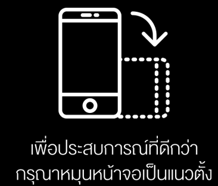
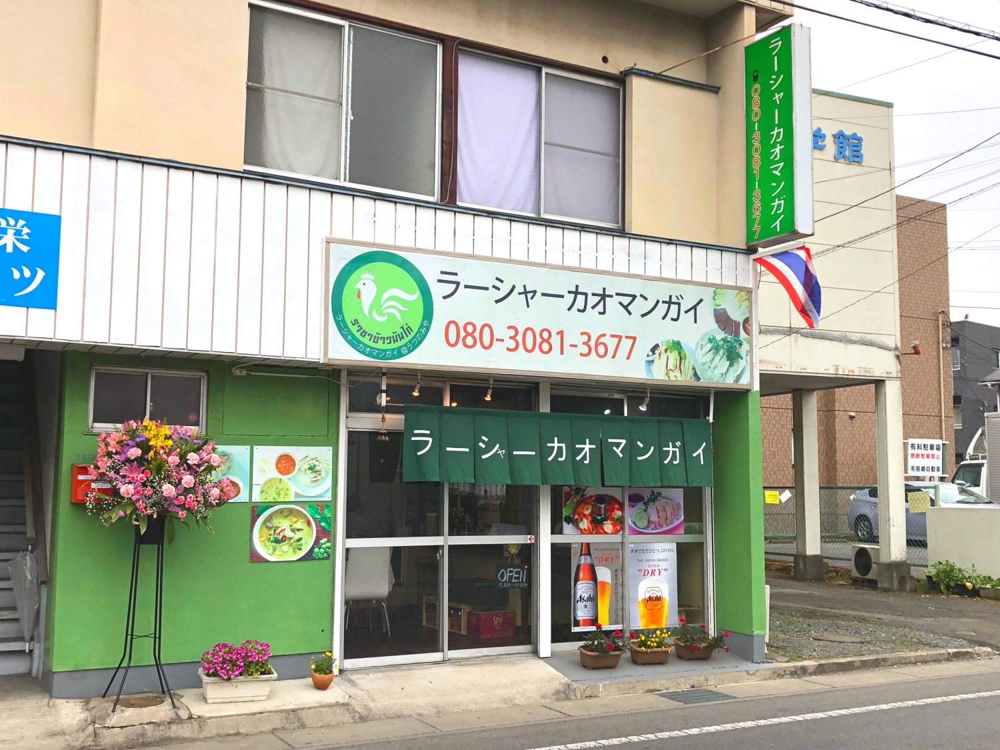
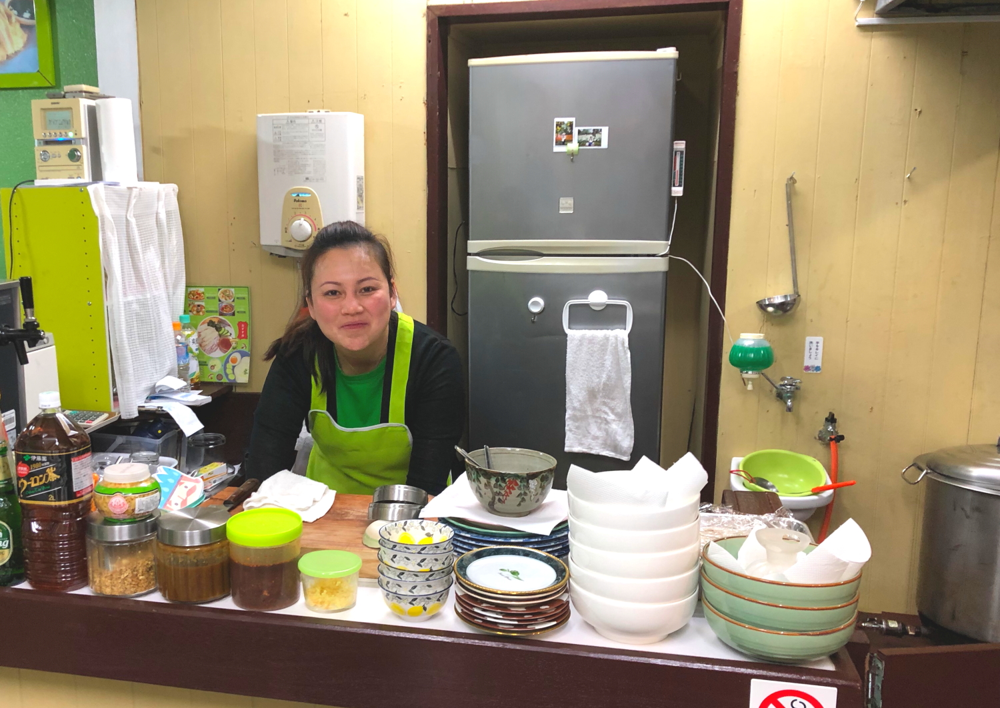
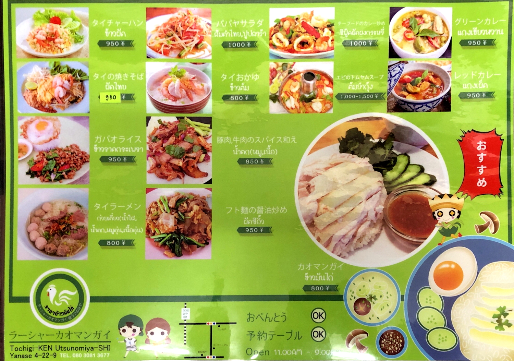

# kaomangai

<html lang="th">
 <head>
  <meta charset="utf-8" />
 

<link href="https://cdnjs.cloudflare.com/ajax/libs/lightbox2/2.7.1/css/lightbox.css" rel="stylesheet">
 
</head>

<body>

ラーシャー・カオマンガイ

<h1><marquee behavior="lrft">!!!ラーシャー・カオマンガイ@宇都宮市簗瀬４丁目２２!!!</marquee></h1>

<marquee direction="right" scrollamount="5" width="90%">TEL:080-3081-3677</marquee>

       

 

<!--

 
-->
<h3>↓ 2019/03/30</h3>

<!--

-->

                          

                          

Map
 
<iframe src="https://www.google.com/maps/embed?pb=!1m18!1m12!1m3!1d6426.081557253202!2d139.89929972696638!3d36.554398589652195!2m3!1f0!2f0!3f0!3m2!1i1024!2i768!4f13.1!3m3!1m2!1s0x0%3A0x87885a2940e0f690!2z44Op44O844K344Oj44O844O744Kr44Kq44Oe44Oz44Ks44Kk!5e0!3m2!1sja!2sjp!4v1555501397356!5m2!1sja!2sjp" width="600" height="450" frameborder="0" style="border:0" allowfullscreen></iframe>

  
<!-- フッタ -->
 <footer>
 Copyright 2019/04/17 Torokoid.Mibu
</footer>
