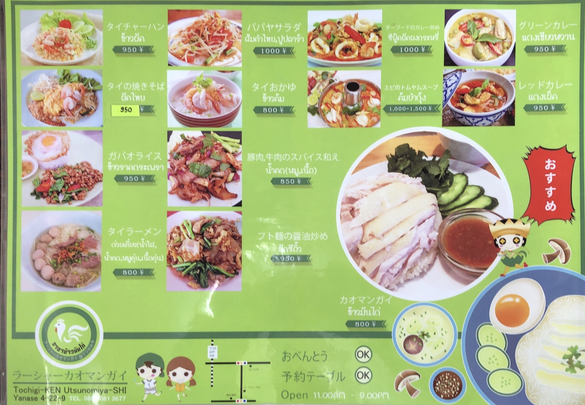

# kaomangai

<html lang="th">
 <head>
  <meta charset="utf-8" />
 

<link href="https://cdnjs.cloudflare.com/ajax/libs/lightbox2/2.7.1/css/lightbox.css" rel="stylesheet">
 
</head>
<!--
<body onload="alert('ゴーさん、お疲れ様でした。またやりましょう！')" onunload="alert('再会の時まで、元気でお過ごしくださいませ〜(^o^)/')">
-->

ラーシャー・カオマンガイ

<h1><marquee behavior="lrft">!!! 2562/04/17@ラーシャー・カオマンガイ!!!</marquee></h1>

<marquee direction="right" scrollamount="5" width="90%">TEL:080-3081-3677</marquee>

       

 

 

<h3>↓ 2019/04/17</h3>

                          

                          

Map
 
<iframe src="https://www.google.com/maps/embed?pb=!1m24!1m12!1m3!1d3223.6326995895047!2d99.90291207190408!3d20.19486840296444!2m3!1f0!2f0!3f0!3m2!1i1024!2i768!4f13.1!4m9!3e0!4m3!3m2!1d20.194487!2d99.9033831!4m3!3m2!1d20.194192299999997!2d99.903494!5e0!3m2!1sja!2sth!4v1554910636509!5m2!1sja!2sth" width="900" height="675" frameborder="0" style="border:0" allowfullscreen></iframe>

  
<!-- フッタ -->
 <footer>
 Copyright 2019/04/17 Torokoid.Mibu
</footer>
